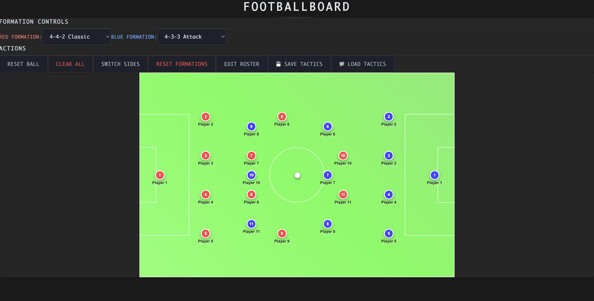

# Football Tactics Board ⚽

As an avid football fan, I love analyzing team formations and drawing up lineups before big matches. Tactical planning is one of my favorite aspects of the beautiful game.

## What is this?

This is an interactive Football Tactics Board application built with React and TypeScript. It provides a clean, responsive interface where you can:

- **Position players** on a realistic football pitch using smooth drag-and-drop
- **Switch between teams** (home/away) with distinct colors
- **Apply formations** like 4-4-2, 4-3-3, 3-5-2, and more
- **Reset positions** to quickly try different setups
- **Responsive design** that works on desktop, tablet, and mobile

The app features a glassmorphism design with smooth animations and is optimized for performance with modern React patterns.

## Built With

- React 18 + TypeScript
- Vite (lightning-fast build tool)
- Tailwind CSS (styling)
- @dnd-kit (accessible drag-and-drop)
- Zustand (state management)

## What's Next?

I'm currently exploring adding the ability to **load historical lineups** from various clubs and national teams across different years. Imagine being able to instantly load:

- Brazil's 2002 World Cup winning formation
- Barcelona's 2009 Champions League final lineup
- Your favorite club's formation from their title-winning season
- Classic formations from football history

This would make the app not just a tactical planning tool, but also a way to explore and learn from football's greatest teams and moments.

*Built by a football fanatic* ⚽
